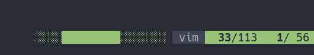

# vim-scrollstatus

A scrollbar for Vim statusline.



## Installation

With [vim-plug](https://github.com/junegunn/vim-plug), in your `.vimrc`:

```vim
call plug#begin()
Plug 'ojroques/vim-scrollstatus'
call plug#end()
```

## Usage
With [vim-airline](https://github.com/vim-airline/vim-airline):
```vim
let g:airline_section_x = '%{ScrollStatus()}'
```

To also show cursor relative position in the window (with `X` here):
```vim
let s:scrollstatus_symbol_cursor = 'X'
```

You can also change the symbols used for the bar and background track, see example below.

## Example

To reproduce the scrollbar from the screenshot:
```vim
let s:scrollstatus_symbol_track = '░'
let s:scrollstatus_symbol_bar = '█'
let g:airline_section_x = '%{ScrollStatus()}'
let g:airline_section_y = airline#section#create_right(['filetype'])
let g:airline_section_z = airline#section#create([
            \ '%#__accent_bold#%3l%#__restore__#/%L', ' ',
            \ '%#__accent_bold#%3v%#__restore__#/%3{virtcol("$") - 1}',
            \ ])
```
